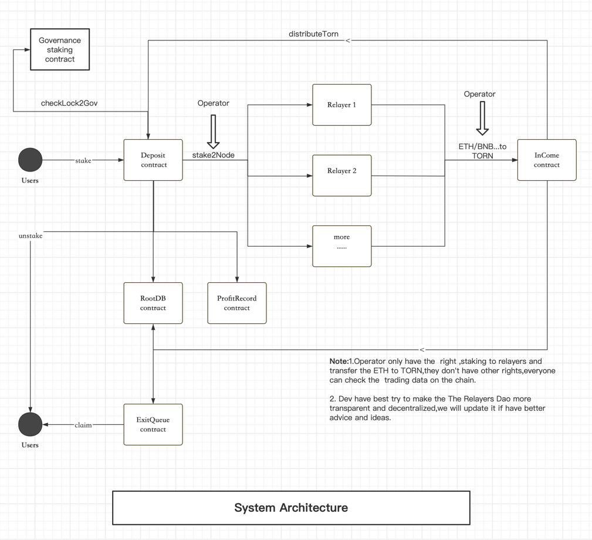

# Tornado Cash Relayers Staking Protocol

Relayers Dao is the Tornado Cash relayers staking protocol,which allows their users to earn relayers staking rewards without locking TORN or maintaining relayers infrastructure.

Relayers Dao will definitely motivate more people to know theTornado Cash and become the relayers.

The Relayers Dao can reduce the torn circulation and pump up the price of TORN.

Currently,the amount of TORN locked in the Tornado Cash governance contract is 761,984 TORN when Tornado Cash staking average APR is 20-70%.The amount of TORN locked in the Relayers Dao will be 2-3 times because the relayers staking average APR is 100-200%,you can image the TORN price.



# Relayers Dao consists of several parts:
- Deposit contract(Deposit TORN into relayers and governance): [0x3654EcfC4e406c8320DCE4Af95C318369488f6b6](https://etherscan.io/address/0x3654EcfC4e406c8320DCE4Af95C318369488f6b6)
- InCome contract(Receive reward): [0x875d48f26b1f0e41D62A76446A5D25905Bcf6395](https://etherscan.io/address/0x875d48f26b1f0e41D62A76446A5D25905Bcf6395)
- ExitQueue contract(Unstake TORN and queue if the TORN liquidity is not enough): [0x4Ddc2B9a75b67D8A049475838CF3D1326aCc0177](https://etherscan.io/address/0x4Ddc2B9a75b67D8A049475838CF3D1326aCc0177)
- RootDB contract(Record some data,for example,contract address,TORN amount for usrs,etc.): [0x2fB6ac90378d4065a0D750cE42CDDD7E85835609](https://etherscan.io/address/0x2fB6ac90378d4065a0D750cE42CDDD7E85835609)
- ProfitRecord contract(Record user's reward from staked TORN.): [0xdB97042c66A41740cD5C58BCF934151F9E09cA6f](https://etherscan.io/address/0xdB97042c66A41740cD5C58BCF934151F9E09cA6f)

# Operator
Operator has 2 rights include staking TORN on Tornado Cash relayers,transfer the ETH to TORN.

# How to work?
1. To stake TORN with Relayers Dao,the user sends TORN to the Deposit smart contract.
1. All deposits into Relayers Dao are assigned to operators who use these deposits TORN to Tornado Cash relayers and governance contract.
1. All Relayers' reward will be sent to the income contract,transfer ETH/BNB...to TORN is executed by operators when the reward reaches a certain amount.
1. TORN reward will be sent to Deposit contract,these TORN will be sent to governance contract ,users who unstake TORN and ExitQueue contract.
1. Once users who want to withdraw TORN,they can unstake if the TORN is enough on the Deposit contract,otherwise,they just wait for claiming TORN if it is enough on the ExitQueue contract when send TORN on this contract.


## Initialization

1. `cp .env.example .env`
2. `yarn`

#### Run tests:

```
    npx hardhat test
```

#### Run coverage:

```
   npx hardhat coverage
```

####  Verify code
```
   hardhat --network eth etherscan-verify --api-key <your key>  --api-url https://api.etherscan.io
```

